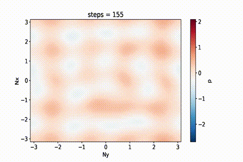

Torch QG
=== 

torchgq is a **differentiable** single-layer quasi-geostrophic PDE solver implemented using [PyTorch](https://pytorch.org/). The numerical method used is a pseudo-spectral domain decomposition which allows for idealized geometries (only doubly-periodic ones are supported for now). 

## Usage

See `main.py` in the root folder for a simulation example based on [Graham et al. 2013](https://doi.org/10.1016/j.ocemod.2013.01.004). A notebook with a simple end-to-end trained parametrization might appear later.

## Research

The code was initially developped for subgrid-scale (SGS) parametrization learning, in particular with an end-to-end approach, i.e. where gradient of the forward solver is available. The first reference describing the setup can be accessed [here](https://arxiv.org/pdf/2111.06841.pdf).

## Demo

**Stream Function**

**Gradient**

**Gradient (2nd Order)**

